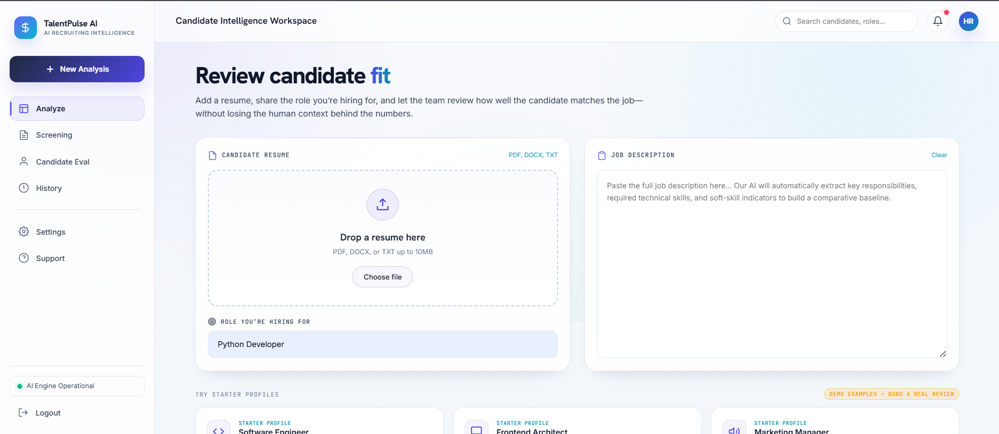
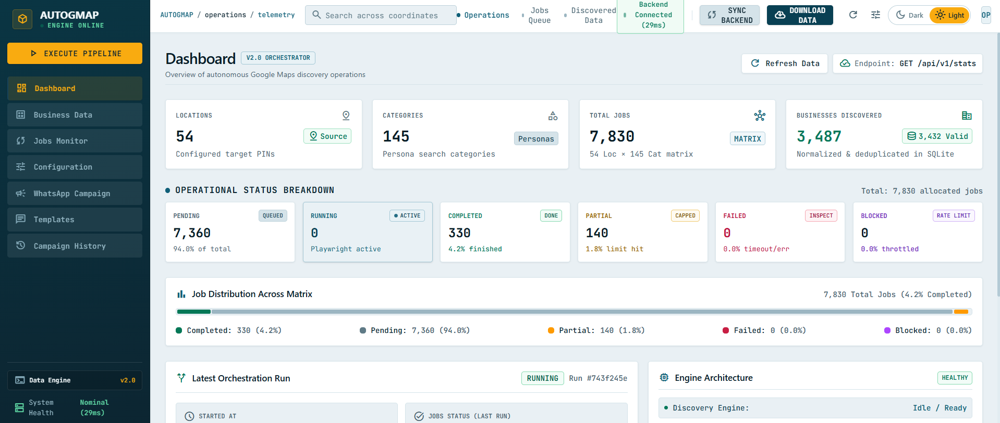

# 🌟 Mansi Kanchan — Developer Portfolio

Welcome to my **personal portfolio website**!  
This project showcases my **skills, projects, and experiences** as a Computer Science & Engineering student passionate about **Full Stack Development, Android Development, and AI-powered automation**.  

🔗 **Live Website:** [View Portfolio](https://mansi-portfolio-jd1f.onrender.com/)

---

## 🚀 Features

- 🎨 Clean and modern UI with smooth animations  
- 📱 Fully responsive design for all devices  
- 🧑‍💻 Showcases my projects with descriptions and live demos 
- 📩 "Hire Me" button in About section for quick reach  

---

## 💼 Projects Showcased

### 1. TalentPluse AI — Resume & JD Matcher (Python, FastAPI, Google Gemini, React, Vite)
An **AI-powered resume and job description matching platform**. It analyzes resumes against job descriptions, identifies matching skills and skill gaps, suggests improvements, generates interview questions, and provides evidence-based screening insights.  
🔗 [Repository](https://github.com/mansikanchan2003/AI-Resume-Matcher)

### 2. AutoGMap — Autonomous Data Discovery & Orchestration Platform (Python, FastAPI, Playwright, React, Vite)
An **autonomous lead generation and outreach platform**. It discovers businesses from Google Maps using category and pincode inputs, extracts and validates contact details, removes duplicates, and supports automated WhatsApp campaigns with personalized messages, media, and lead forms.  
🔗 [Repository](https://github.com/mansikanchan2003/G-Map_Data_Scraper_2.0)

### 3. BuzzChat (Java, Android Studio, Firebase)
A **real-time chat application** with Firebase authentication, profile updates, and media sharing via Firebase Storage.  
🔗 [Repository](https://github.com/mansikanchan2003/BuzzChat2)

### 4. BuzzBot (React.js, OpenAI API)
An **AI-powered chatbot** integrated in a React-based chat app, managing state via Context API and handling async API calls smoothly.  
🔗 [Repository](https://github.com/mansikanchan2003/buzzbot)

### 5. QuizApp (React.js, Firebase, Vite)
A **quiz platform** with authentication, quiz creation, leaderboards, and certificate generation for completed quizzes.  
🔗 [Live Demo](https://mansikanchan2003.github.io/quizz-app/)

---

## 🧑‍💼 Experience

### AI Automation Intern — Eko (On-site, Gurugram, Haryana, India)
*Sept 2026 – Present*  
Working on **AI-powered automation workflows**, focusing on autonomous business process automation, Google Maps lead generation, browser automation, Prompt Engineering, MCP, Selenium, and Playwright. Developing automation solutions for business lead discovery, data extraction, validation, and WhatsApp-based outreach campaigns with personalized messaging and lead-form integration.

---

## 📸 Screenshots  

### 🏠 Home Page  

### 💼 About Section  

### 🛠️ Skills Section  

### 🤖 TalentPluse AI — Resume Analysis  

### 🗺️ AutoGMap — Dashboard  

---

## 🛠️ Tech Stack

- **Frontend:** HTML, CSS, JavaScript, React.js, Vite, Tailwind CSS  
- **Backend:** Python, FastAPI, Firebase, Java (for Android apps), Spring Boot  
- **AI & Automation:** Google Gemini, OpenAI API, Prompt Engineering, MCP, Playwright, Selenium  
- **Tools:** Git, GitHub, Android Studio, VS Code  

---

## ☁️ Deployment

The site is a **static website** — no build step is required.

- **GitHub Pages:** served from `index.html` at the repository root.  
- **Render (live):** [mansi-portfolio-jd1f.onrender.com](https://mansi-portfolio-jd1f.onrender.com/) — a [`render.yaml`](render.yaml) blueprint is included. In the Render dashboard choose **New → Blueprint**, connect this repository, and apply — Render publishes the repository root as a static site and redeploys automatically on every push to `main`.

---

## 📬 Contact Me

- 📧 Email: **kanchan.mansi2003@gmail.com**  
- 🔗 LinkedIn: [Mansi Kanchan](https://www.linkedin.com/in/mansi-kanchan-7924b0196)  

---

⭐ If you like my portfolio, don't forget to **star this repository**!
