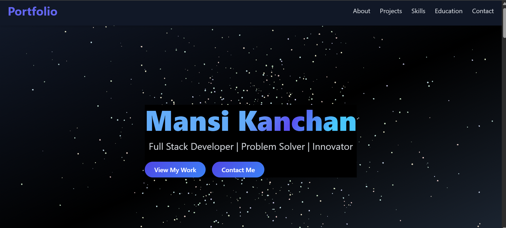
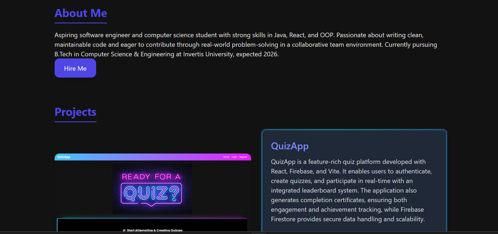
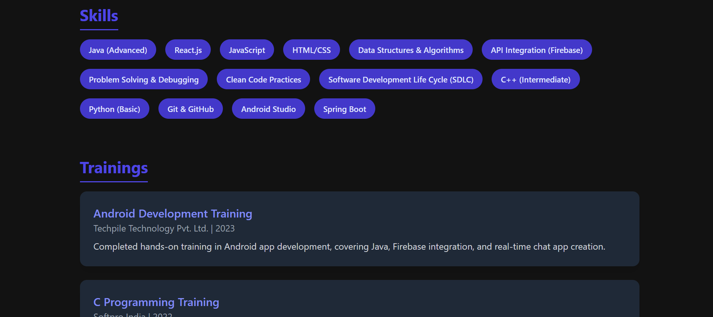

# 🌟 Mansi Kanchan — Developer Portfolio

Welcome to my **personal portfolio website**!  
This project showcases my **skills, projects, and experiences** as a Computer Science & Engineering student passionate about **Full Stack Development, Android Development, and AI-powered applications**.  

🔗 **Live Website:** [View Portfolio]([https://mansikanchan2003.github.io/MyPortfolio/](https://mansi-portfolio-jd1f.onrender.com/))

---

## 🚀 Features

- 🎨 Clean and modern UI with smooth animations  
- 📱 Fully responsive design for all devices  
- 🧑‍💻 Showcases my projects with descriptions and live demos 
- 📩 "Hire Me" button in About section for quick reach  

---

## 💼 Projects Showcased

### 1. BuzzChat (Java, Android Studio, Firebase)
A **real-time chat application** with Firebase authentication, profile updates, and media sharing via Firebase Storage.

### 2. BuzzBot (React.js, OpenAI API)
An **AI-powered chatbot** integrated in a React-based chat app, managing state via Context API and handling async API calls smoothly.

### 3. QuizApp (React.js, Firebase, Vite)
A **quiz platform** with authentication, quiz creation, leaderboards, and certificate generation for completed quizzes.

---

## 📸 Screenshots  

### 🏠 Home Page  

### 💼 About Section  

### Skills Section  

 

---

## 🛠️ Tech Stack

- **Frontend:** HTML, CSS, JavaScript, React.js  
- **Backend:** Firebase, OpenAI API, Java (for Android apps)  
- **Tools:** Git, GitHub, Android Studio, VS Code , Spring Boot

---

## 📬 Contact Me

- 📧 Email: **kanchan.mansi2003@gmail.com**  
- 🔗 LinkedIn: [Mansi Kanchan](https://www.linkedin.com/in/mansi-kanchan-7924b0196)  

---

⭐ If you like my portfolio, don’t forget to **star this repository**!
